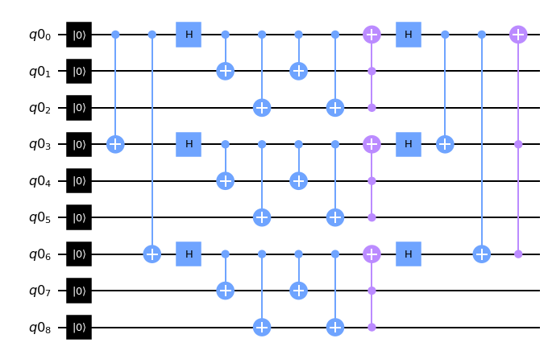

# QDB - CLI Quantum Benchmarking and Optimization Platform 
## Contents
- [QDB](#qdb---cli-quantum-benchmarking-and-optimization-platform)
  * [Overview](#overview)
  * [QDB Usage](#qdb-usage)
    + [Dependencies](#dependencies)
    + [Benchmarking Gate Fidelities](#benchmarking-gate-fidelities)
    + [Decomposing and Evaluating Circuits](#decomposing-and-evaluating-circuits)
    + [Comparing Quantum Circuits](#comparing-quantum-circuits)
    + [qdb -h](#qdb--h)
  * [Benchmarking the Starmon-5 Hardware](#benchmarking-the-starmon-5-hardware)
    + [Measuring Gate Fidelities](#measuring-gate-fidelities)
    + [Predicting Algorithm Success](#predicting-algorithm-success)
  * [Personal Experiences](#personal-experiences)
  * [Sources](#sources)
## Overview
This project was designed to automate the process of obtaining a hardware error profile of a quantum computer with the purpose of evaluating models of different error correcting protocols. One of the most studied families of error correcting codes, the stabilizer codes, are based on parity checks which are realized with gates from the set of Clifford gates. In this project, we investigate how the topology and capacity to realize these gates on quantum hardware impacts the efficacy of an error correcting code. We benchmark the gate fidelity of the Starmon-5 quantum processor to calibrate a toy model for error propagation. 

To this end, we present QDB, a command-line debugging tool that integrates the process of both measuring gate fidelities, as well as deriving and theoretical performance of various circuits. We envision near-term quantum computer scientists using such a tool to automatically decide on a per-computer basis what codes and algorithms to use to reach tight error bounds. Future compilers, however, could use a similar procedure to obfuscate the error correction process, and maximize performance without any user intervention.

To test the efficacy of our setup, we implement a range of QEC algorithms as well as their logical operations. We explicitly developed our algorithms such that we both respected the X-shaped nearest neighbor coupling, as well as utilized operations implemented on the Starmon-5. This allowed us to compare experimental error propagation with QDB’s success rate predictions. In total we constructed circuits for the following codes:
- Bit Flip Code
- Phase Flip Code
- [[4,2,2]] Code
- Steane [[5,1,3]] code
- Steane [[7,1,3]] code
- Shor Code

Of these, the [4,2,2] code, and the bit- and phase-flip codes were benchmarked on the Quantum Inspire backend.

## QDB Usage
### Dependencies
To install all dependencies automatically run:
```
pip install -r requirements.txt
```
QDB depends on the following packages:
```
coreapi==2.3.3
numpy==1.22.0
qiskit==0.34.1
qiskit_ignis==0.7.0
quantuminspire==1.7.0
```

### Benchmarking Gate Fidelities
Use `./qdb bench --arch (architecture)` to populate extra/Starmon-5.csv or extra/Spin-2.csv with their respective gate fidelities. Note this process takes some time, and the files are preincluded with this repository.
#### Examples
```
./qdb bench --arch Starmon-5
./qdb bench --arch Spin-2
```
#### Demonstration
[](https://asciinema.org/a/NtypYIcD0v2OiHpNW8jZY3Ucr)

### Decomposing and Evaluating Circuits
Use `./qdb dec --arch (architecture) --circuit (circuit path)` to decompose a circuit into its composite gates, and calculate success probability based on previously measured gate fidelities. Also shows breakdown of each gate's overall error contribution.  
#### Examples
```
./qdb dec --arch Starmon-5 --circuit qasm_files/bit_flip.qasm
./qdb dec --arch Starmon-5 --circuit qasm_files/FourTwoTwo_Logical_X1.qasm
```
#### Demonstration
[](https://asciinema.org/a/LQzkPraU3u9F5fxeJGNBpbpvX)

### Comparing Quantum Circuits
Use `./qdb comp --arch (architecture) --circuit (circuit paths)` to compare multiple circuit's theoretical performance on a hardware platform. Ranks each by predicted success rate, and further displays total number of gates in each, and largest error channel. Useful with `--measure false` on simpler circuits where measurements form the largest error channel.

#### Examples
```
./qdb comp --arch Starmon-5 --circuit qasm_files/bit_flip.qasm qasm_files/phase_flip.qasm
./qdb comp --arch Starmon-5 --circuit qasm_files/FourTwoTwo_Logical_*

```
#### Demonstration
[](https://asciinema.org/a/taaNmgz1OEVZulX1TGXKGmCqB)

### qdb -h
```
usage: qdb [-h] [--circuit [CIRCUIT ...]] [--arch ARCH] [--measure MEASURE] mode

QDB Quantum Circuit Debugger

positional arguments:
  mode                  (BENCHmark|DECompose|COMPare)

options:
  -h, --help            show this help message and exit
  --circuit [CIRCUIT ...]
                        Input Circuit .qasm
  --arch ARCH           QC Architecture (Starmon-5|Spin-2)
  --measure MEASURE     Include Measurement Error (True|False)
 ```
 
 ---
 
## Benchmarking the Starmon-5 Hardware

### Measuring Gate Fidelities

We utilized a variety of circuits and measurements to estimate the probability of successfully executing each quantum gate used on Starmon-5. We first performed a measurement of the 0 state to approximate the success of a single measurement, which turned out to be around 94.9%. This very simple circuit can be found below. 


We then proceeded to evaluate the performance of each basic single qubit gate. For the basic cases of the X, Y gates we used the circuits found below

 

We wished to evaluate the fidelity of each gate independently of the measurement accuracy, so we calculated the desired fidelity as Accuracy of X Gate = (% of correct measurements)/(Standard Measurement Error), using the Standard Measurement Error (SME) that we calculated in our first step. For the purposes of our model, we considered the probability of both the gate and the measurement malfunctioning (and thus leading to a correct measurement result) to be negligible. 

We then proceeded to test the Hadamard Gate, using the simple circuit given below. 


Here, it is a bit trickier to calculate the error resulting from the Hadamard Gate. Since the measurement error is the same independently of whether the + state collapses to 0 or 1, the measurement error is not involved in the result, i.e., we are observing the quality of the Hadamard directly.  Thus, we assumed that if p percent (0<p<1) of our measurement collapses to the 0 state, then the fidelity of our Hadamard is 2p-1. This result proved to be a successful approximation, and was further backed up by the hadamard's raw probability being roughly in line with the other single qubit gates.

For the Z gate, we used the following circuit. 


We once again divided the percentage of correct measurement results by the SME to obtain the fidelity of the Z gate. We also mathematically showed that the fidelity of the H gate needs not be taken into account, since small errors in the H gate will have very little effect to the measurement result. 

A similar technique was used for the CZ gate, shown below:


Once again, the H gates need not be taken into consideration. However, in this case, we need to divide the experimentally measured probability of measuring the right result by F_X*SME^2, where F_X is the probability the X gate fails, and SME the standard measurement error (note that we are doing two measurements, hence the square). 

Finally, the exact same correction, i.e., dividing by F_X*SME^2,  was used for the CNOT, SWAP gates, with the circuits shown below. 

 


### Predicting Algorithm Success

The process of predicting the success rate of a specific algorithm is incredibly straightforward. The user needs only pass the code producing their circuit as an argument to our code. Our algorithm will decompose the circuit and identify all types of gates, as well as how many times each gate appears. It then proceeds to predict the probability of the algorithm succeeding by multiplying the products of the form (Gate Fidelity)^(#appearences) for each type of gate. We end by multiplying our final result by SME^(#measurements), to account for the measurement errors in the circuit. The algorithm is able to estimate the success rate of any algorithm composed with our tested gates, and use it to decide what error correction code works best with Starmon-5. 

Error Correcting Codes
We began by implementing a repetition code on the Starmon-5. We discovered that this code could be implemented easily with the coupling between the central and outer qubits in the “star” pattern. All error-correcting codes operate through redundant encoding of information to decrease the information entropy, and therefore the randomness and susceptibility to error, inherent to a message. The classical repetition code represents the most straightforward application of redundancy, and the quantum repetition code extends this principle to the laws of quantum information by encoding the information in an entanglement. The largest code available to us with the Starmon-5 are the 3-bit (distance 3) bit- and phase-flip repetition codes. This is because stabilization of the code requires measurement of 2 parity-check operators. This is a common feature of the codes we explore in this paper. Every code can be defined by a set of operators called stabilizers. If k ”logical” qubits are to be encoded in n physical qubits, then a set of n-k mutually commuting operators from the Pauli group can be found. These operators will share a mutual +1 eigenspace that defines the code-words. Furthermore, k pairs of “Logical operators” can be found, which commute with the stabilizers but are not a member of the stabilizer group.

At first, we used Qiskit and automatically transpiling our code to address this topology. The transpiler introduced extra SWAP gates to respect the original ordering of the qubits. We optimized the circuitry to reduce the number of SWAP gates necessary to perform the encoding and stabilizer measurements. 


Quantum Circuit 1: Bit flip repetition code


Quantum Circuit 2: Phase flip repetition code


Quantum Circuit 3: Shor Code


Quantum Circuit 4: Steane [[5,1,3]] Code


Quantum Circuit 5: Steane [[7,1,3] Code


## Personal Experiences
Our hacking began yesterday morning in the blinding snow. We quickly abandoned our plans to meet in a building across campus and instead congregated in a dorm with a day’s worth of snacks to begin working in earnest. Our team had grown to five members over the past week. We started off in our own direction, each of us sifting through papers to try to pry open the inner workings of error correction and investigate its practical applications. Argy and Sofia began an intense conversation about error propagation while Ben and Wyatt muddled through different schemes for error detection and correction. We ate our cold meals that we had squirreled away, because the dining halls were all closed for the snow. Over the next hour, Alex started to type furiously, and then shared with us his plan to write a program to automate the process of error analysis. We rallied around this common goal for our project. We continued working intently, becoming increasingly bold in our usage of the Quantum Inspire backends, only stopping to sing Bohemian Rhapsody and for a brief game of Smash Bros. This hackathon has been the first for all of our members, and it has been a valuable learning experience.

## Sources
Chen, Zijun, et al. “Exponential Suppression of Bit or Phase Errors with Cyclic Error Correction.” Nature, vol. 595, no. 7867, July 2021, pp. 383–87. www.nature.com, https://doi.org/10.1038/s41586-021-03588-y.

Córcoles, A. D., et al. “Demonstration of a Quantum Error Detection Code Using a Square Lattice of Four Superconducting Qubits.” Nature Communications, vol. 6, no. 1, Apr. 2015, p. 6979. www.nature.com, https://doi.org/10.1038/ncomms7979.

Hu, Atsushi, et al. Quantum Benchmarking on the [ [ 4 , 2 , 2 ] ] Code. 2018, https://www.semanticscholar.org/paper/Quantum-Benchmarking-on-the-%5B-%5B-4-%2C-2-%2C-2-%5D-%5D-Code-Hu-Li/a52bac24bd530673543db74acfb9f7447b51d28e.

Linke, Norbert M., et al. “Fault-Tolerant Quantum Error Detection.” Science Advances, Oct. 2017. world, www.science.org, https://doi.org/10.1126/sciadv.1701074.

Preskill, John. Lectures on Quantum Computation, Quantum Error Correcting Codes and Information Theory. http://theory.caltech.edu/~preskill/ph229/notes/chap7.pdf. Accessed 30 Jan. 2022.

Satzinger, K. J., et al. “Realizing Topologically Ordered States on a Quantum Processor.” Science, vol. 374, no. 6572, Dec. 2021, pp. 1237–41. arXiv.org, https://doi.org/10.1126/science.abi8378.

Terhal, Barbara M. “Quantum Error Correction for Quantum Memories.” Reviews of Modern Physics, vol. 87, no. 2, Apr. 2015, pp. 307–46. arXiv.org, https://doi.org/10.1103/RevModPhys.87.307.


